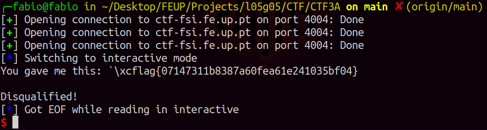

# CTF 3

## Primeira parte

Inicialmente exploramos os ficheiros disponibilizados na plataforma CTF que são os mesmos que estão a ser executados no servidor na porta 4004. 

Com o comando **checksec** verificamos que `program` (main.c compilado) não tem o binário randomizado mas existem proteções do endereço de retorno usando canários. 

```bash
$ checksec --file=program
```

Depois avaliamos o funcionamento do código `main.c`. O input é guardado num buffer de 32 bytes através da função scanf e depois impresso por **printf** para sem argumentos adicionais. Assim, é possível usar "format string attack" para usurpar o seu funcionamento, já que não há randomização dos endereços.

Quando a função `load_flag` é invocada lê a flag contida no diretório para outro buffer que é uma variável global e, portanto, está alocado na Heap. Ao descobrir o endereço da função é possível retornar o valor da string do buffer.

Para descobrir o endereço da função, usamos o debugger gdb:

```bash
$ gdb program
$ p load_flag
```

O resultado foi o endereço de retorno "0x08049256", que é "\x60\xC0\x04\x08" em formato de string.

Usando o programa em python disponibilizado, injetamos o input que contém o exploit:

```python
p.recvuntil(b"got:")
p.sendline(b"\x60\xC0\x04\x08%s")
p.interactive()
```



Ao executar conseguimos ter acesso ao conteúdo do ficheiro `flag.txt` e à flag do desafio, `flag{07147311b8387a60fea61e241035bf04}`.

## Segunda parte

