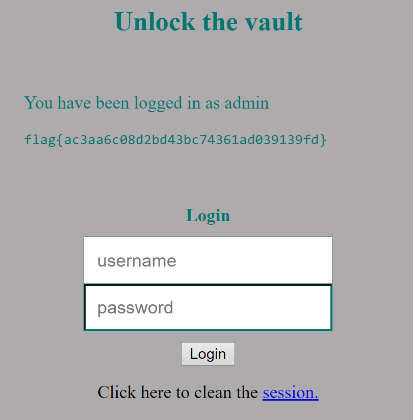

# CTF 4

## Primeira parte

Inicialmente exploramos os ficheiros disponibilizados na plataforma CTF que são os mesmos que estão a ser executados no servidor na porta 5003. <br>
Verificamos que a base de dados usada é SQLite3 e quando o username é 'admin' o conteúdo do ficheiro `flag.txt` é mostrado na página web. Na parte do login a query utilizada é frágil pois o servidor cria o comando dinamicamente com as strings não sanitizadas do input do utilizador:

```php
$username = $_POST['username'];
$password = $_POST['password'];             
$query = "SELECT username FROM user WHERE username = '".$username."' AND password = '".$password."'";
```

Ao usarmos o input "admin'--" através de SQL Injection garantimos o acesso privilegiado, pois todo a verificação da palavra chave torna-se irrelevante uma vez que é comentada. Assim, o código executado do lado do servidor passou a ser o seguinte:

```sql
SELECT username FROM user WHERE username = 'admin'# AND password = $password
```

Tal como esperado, conseguimos fazer login com a conta do administrador e assim ter acesso ao conteúdo do ficheiro `flag.txt` e à flag do desafio, `flag{ac3aa6c08d2bd43bc74361ad039139fd}`.



## Segunda parte

checksec
Não tem canários nem randomização de endereços
