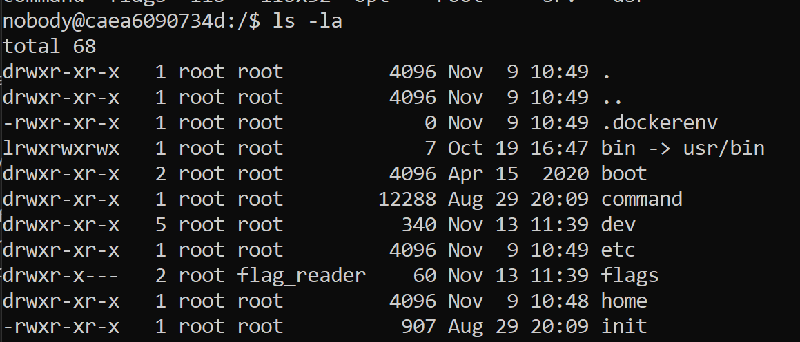

# Brittish Punctuality

Verificamos que não temos permissão para abrir diretamente o ficheiro `flags/flag.txt`, mas o utilizador "flag_reader" tem:



No diretório "/tmp" existe um ficheiro "last_log.txt" que é atualizado todos os minutos, com permissões de flag_reader, através do **cronscript** (/etc/cron.d/mycronscript) seguinte:

```note
* * * * * flag_reader /bin/bash -c "/home/flag_reader/my_script.sh > /tmp/last_log"
```

Verifica-se que este quando este script é executado, este por sua vez executa `/home/flag_reader/my_script.sh`, e o output é guardado em `/tmp/last_log`. O conteúdo de `my_script.sh` é o seguinte:

```bash
#!/bin/bash

if [ -f "/tmp/env" ]; then
    echo "Sourcing env"
    export $(/usr/bin/cat /tmp/env | /usr/bin/xargs)
    rm /tmp/env
fi

printenv
exec /home/flag_reader/reader
```

Podemos ver que, se o ficheiro `/tmp/env` existir, vai ser executado o seu conteúdo 
