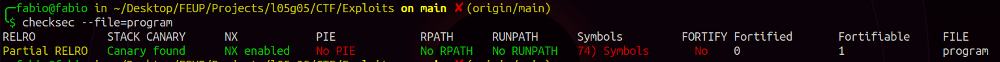
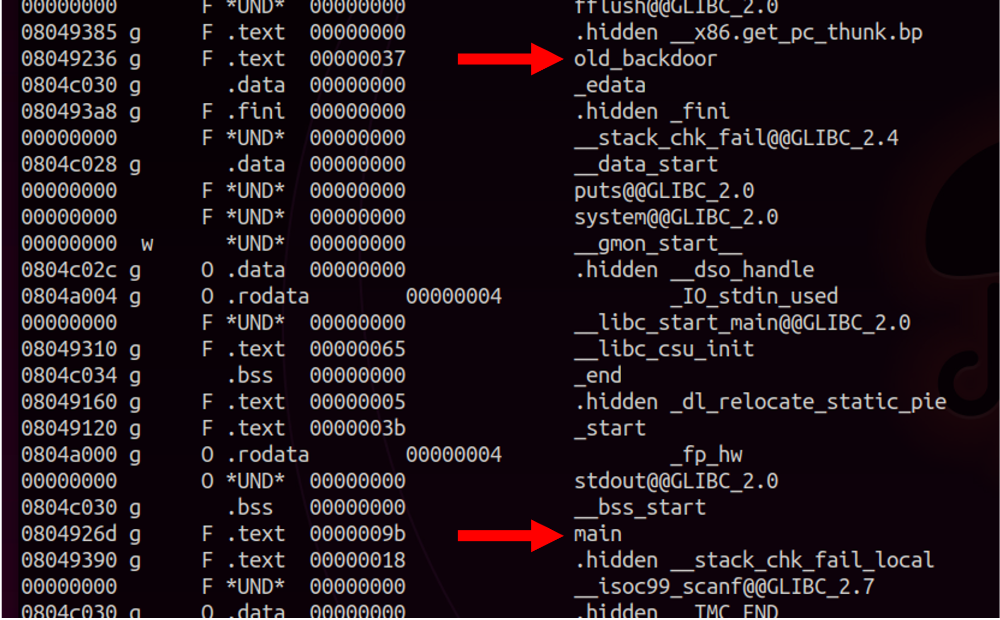
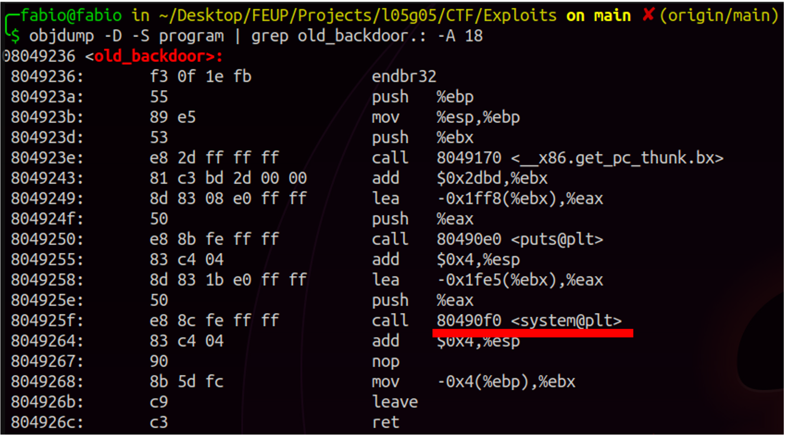
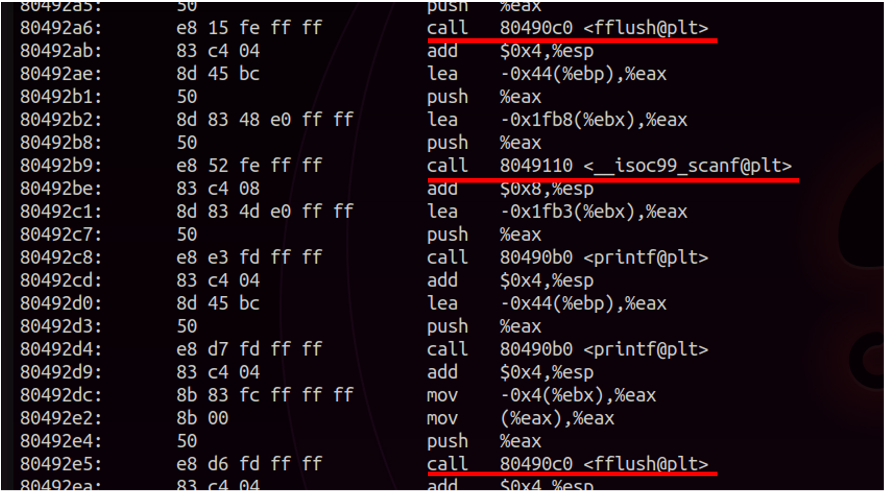

# Final Format - CTF Extra

Inicialmente exploramos o ficheiro disponibilizado na plataforma CTF que é o mesmo que está a ser executado no servidor na porta 4007. Com o comando **checksec** verificamos que `program` não tem o binário randomizado mas existem proteções do endereço de retorno usando canários:



Como só tínhamos acesso ao binário, utilizamos os comandos seguintes para exibir os *exported symbols* e fazer o *disassembly*:

```bash
$ objdump -t program    # show exported symbols
$ objdump -D -S program # show disassembly
```

Isto permitiu ver também o nome das funções implementadas no ficheiro. Destacaram-se de imediato a função `main` e a função `old_backdoor`:



A dica disponibilizada, "Removemos a nossa special feature, já não há flags para ninguém", indica que este CTF tem conexão com o CTF 2 da semana 7. Nesse existia uma backdoor que podia aberta manipulando o valor de uma variável, a "special feature", e com isso ganhar acesso à shell do servidor. Como aqui essa chave já não existe mas há uma chamada ao sistema do género no funcionamento interno da função:



Como a flag (flag.txt) está no *workdirectory* é de interesse que a main chame esta função. Notamos que main invoca `flush()` antes e depois do `scanf()`. Scanf quando incorretamente utilizado permite a cópia de indefinidos bytes do stdin para o buffer local. Com um ataque do género **buffer overflow** podemos usurpar a segunda chamada de `flush()` através do input com **format strings**.

