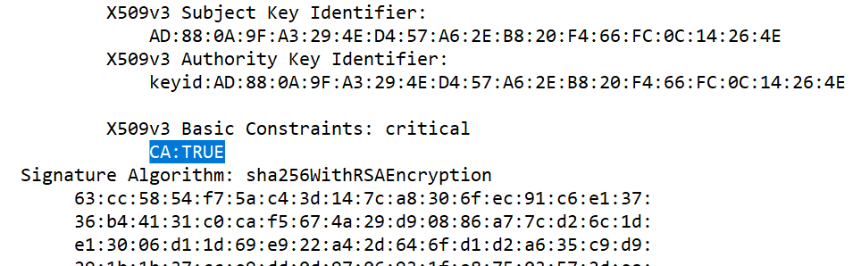
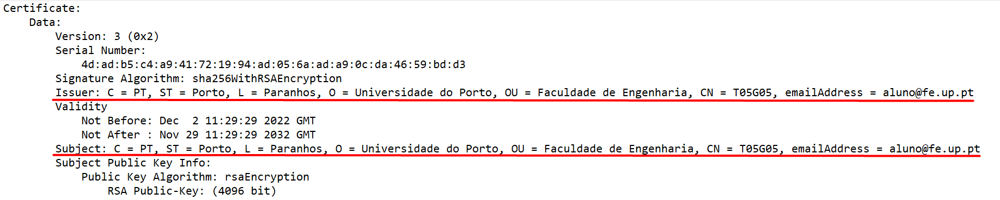
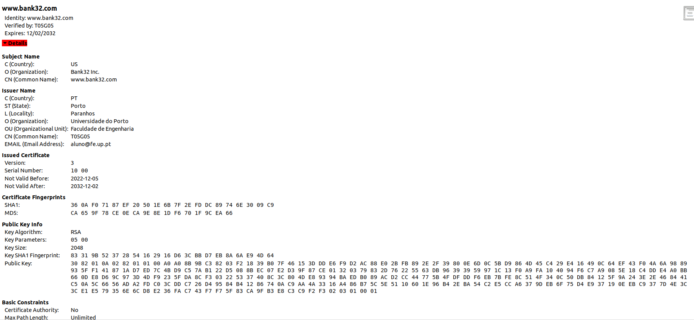
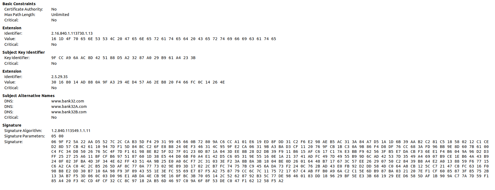
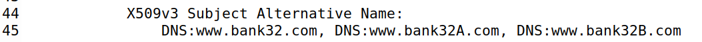

# Public-Key Infrastructure

## Setup

Numa fase inicial adicionamos novas entradas nos hosts conhecidos pela máquina virtual e executamos os containers fornecidos no lab:

```bash
sudo nano etc/hosts     # colocar '10.9.0.80 www.bank32.com'
                        # colocar '10.9.0.80 www.smith2020.com'

$ dcbuild               # docker-compose build
$ dcup                  # docker-compose up
```

## Task 1 -  Becoming a Certificate Authority (CA)

Copiamos o ficheiro de certificado default (presente em `/usr/lib/ssl/openssl.cnf`) para a pasta de trabalho local. Depois comentamos a linha "unique_subject", e fizemos os seguintes comandos para criar o ambiente da nossa própria autoridade de certificação: 

```bash
mkdir myCA && cd ./myCA
mkdir certs crl newcerts
touch index.txt
echo "1000" >> serial
```

Depois fizemos setup da CA:

```bash
openssl req -x509 -newkey rsa:4096 -sha256 -days 3650 -keyout ca.key -out ca.crt
```

Durante o processo colocamos os seguintes dados:

```note
- passphrase (1234)
- nome do país (PT)
- região (Porto)
- cidade (Paranhos)
- organização (UP)
- secção (FEUP)
- nome (T05G05)
- email (aluno@fe.up.pt)
```

Para ver o conteúdo dos ficheiros gerados, decodificamos o certificado X509 e a chave RSA:

```bash
openssl x509 -in ca.crt -text -noout
openssl rsa -in ca.key -text -noout
```

Podemos ver que é um certificado CA uma vez que existe na secção *basic constraints* um atributo *certificate authority* verdadeiro:



Este certificado é *self-signed* pois o campo *issuer* e o campo *subject* é o mesmo:



O conteúdo do ficheiro gerado referente à criptografia usada está disponível [aqui](../docs/CA_RSA.txt). Nele conseguimos identificar os elementos seguintes:
- os dois números primos (campo `prime1` e `prime2`);
- o *modulus* (campo `modulus`);
- os expoentes públicos e privados (campo `publicExponent` e `privateExponent`, respetivamente);
- o coeficiente (campo `coeficient`);

## Task 2 - Generating a Certificate Request for Your Web Server

Geramos através do seguinte comando certificado para o site `www.bank32.com`:

```bash
openssl req -newkey rsa:2048 -sha256 -keyout server.key -out server.csr -subj "/CN=www.bank32.com/O=Bank32 Inc./C=US"  passout pass:1234 -addext "subjectAltName = DNS:www.bank32.com, DNS:www.bank32A.com, DNS:www.bank32A.com"
```

Com isto obtivemos dois ficheiros: o [RSA do site](../docs/SV_RSA.txt) e o [Certificado do site](../docs/SV_REQ.txt).

## Task 3 - Generating a Certificate for your server

Para gerar um certificado para o nosso próprio servidor www.bank32.com, foi necessário correr o seguinte comando:

```bash
$ openssl ca -config openssl.cnf -policy policy_anything -md sha256 -days 3650 -in server.csr -out server.crt -batch -cert ca.crt -keyfile ca.key
```

Com isto obtivemos dois ficheiros: `server.crt`. O conteúdo desse ficheiro permite confirmar que se trata de um certificado para o servidor supracitado:




Para vertificar que, comentamos a linha "descomentar copy_extensions = copy" do ficheiro "openssl.cnf" e corremos o seguinte código:

```bash
$ openssl x509 -in server.crt -text -noout
```

O output permitiu verificar que o certificado abrange todos os nomes colocados na tarefa 2:

- www.bank32.com
- www.bank32A.com
- www.bank32A.com



## Task 4 - Deploying Certificate in an Apache-Based HTTPS Website

## Task 5 - Launching a Man-In-The-Middle Attack

## Task 6 - Launching a Man-In-The-Middle Attack with a Compromised CA