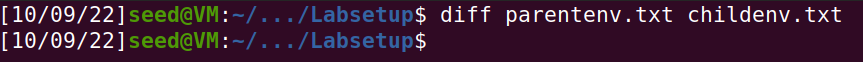

# Environment Variable and Set-UID Program Lab

## Tasks

### Task 1
> Todas as variáveis do sistema podem ser listadas a partir do comando `printenv`. Ao escrever o comando `printenv ENV`, há somente listagem das variáveis contidas no ambiente ENV. Por exemplo:
> ````bash
> $ printenv PWD # /home/seed
> ````

 ### Task 2
> Guardando em dois ficheiros diferentes as variáveis de ambiente do processos pai (parentenv.txt) e filho (childenv.txt), ao fazer a diferença entre os 2, o resultado é vazio:
> 
> Assim, conclui-se que todas as variáveis de ambiente do processo pai são heredadas pelo filho após o fork(), ou seja, não há diferença no ambiente de execução.


### Task 3
> - Ao executar o código do ficheiro "myenv.c" com o terceiro parâmetro do comando "execve" a NULL, as variáveis de ambiente não ser passadas a esse apontador visto que tem valor nulo, originado assim um output vazio.
> - No caso de substituirmos NULL pela variavel "environ", este *array* será usado para passar as variáveis de ambiente.


### Task 4
> - Fazendo uso do comando "system()", verifica-se que é criado um novo processo onde são passadas todas variaveis de ambiente do processo anterior.
> - Já a chamada do "execve()" executa o comando mantendo o processo atual e as mesmas variáveis de ambiente.ubstitui o processo em execução pelo comando passado como argumento, que so mantem as variaveis de ambiente se estas forem passadas como argumento.

### Task 5
> - Set-UID é um mecanismo no sistema de permissões dos ficheiros em UNIX que permite um utilizador executar um programa/ficheiro com as permissões do criador desse programa/ficheiro.
> - Criou-se um programa que mostra todas as variáveis de ambiente do processo atual 
> - Definiu-se 'root' como proprietário do programa e tornou-se o mesmo num programa Set-UID, atraves dos seguintes comandos: 
> ````bash
> $ sudo chown root printenv
> $ sudo chmod 4755 printenv
> ````
> - Por motivos de teste, foram realizadas alterações em algumas variáveis de ambiente:
> ````bash
> $ export PATH=$PATH:/home/seed/Desktop
> $ export LD_LIBRARY_PATH=/home/seed/Documents
> $ export COURSE_NAME=FSI
> ````
> - De seguida, o programa foi executado novamente e verificou-se que as variáveis definidas anteriormente constavam na lista de variáveis de ambiente do programa.
> ````bash
> $ diff printenv_log printenv_log2
> 14a15
> > COURSE_NAME=FSI
> 41a43
> > LD_LIBRARY_PATH=/home/seed/Documents
> 45c47
> < PATH=/usr/local/sbin:/usr/local/bin:/usr/sbin:/usr/bin:/sbin:/bin:/usr
> /games:/usr/local/games:/snap/bin:.
> ---
> > PATH=/usr/local/sbin:/usr/local/bin:/usr/sbin:/usr/bin:/sbin:/bin:/usr games:/usr/local/games:/snap/bin:.:/home/seed/Desktop
> $
> ````

### Task 6


